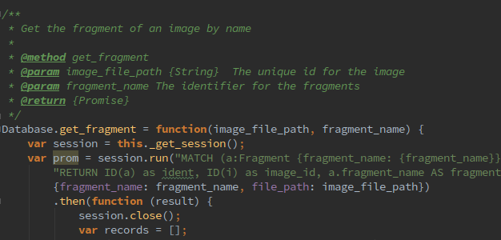

Technical guides
================

Constraints
...........

If you want to ensure the integrity of your data it is a good idea to use constraints.

You can add the in the GUI or to /media/settings/settings.json.

The constraints are evaluated from the GUI. They are currently not automatically called because
they were not used in the first project.

.. code-block:: none

    "count_constraints": [
        {
            "id": 1498744279660,
            "min": "0",
            "max": "3",
            "query": "MATCH(f:Fragment)-[]-(t:Token) WHERE ID(f) = {fragment_id} RETURN t;"
        }
    ],
    "free_constraints": [
        {
            "id": 1498746658301,
            "query": "// session = a neo4j session\r\n// session.run(cypher_string) returns a promise (see the docs)\r\nnew Promise(function(resolve, reject){\r\n    var variables = {\"fragment_id\": fragment_id};\r\n    session.run(\"MATCH(f:Fragment)-[]-(t:Token {value: 'Token'}) WHERE ID(f) = {fragment_id} RETURN t.value as value;\", variables)\r\n        .then(function(result){ \r\n            var value;\r\n            result.records.forEach(function(res){\r\n                value = res.get('value');\r\n                if (value === \"Token2\") {\r\n                    reject(\"There was a token called Token.\");\r\n                }\r\n            });\r\n            resolve();\r\n    }).catch(function(err){\r\n        reject(err);\r\n    });\r\n});"
        }
    ],
    "bool_constraints": [
        {
            "id": 1498747292635,
            "query": "MATCH(f:Fragment)-[]-(t:Token {value: 'Token'}) WHERE ID(f) = {fragment_id} RETURN COUNT(t) > 0;"
        }
    ]

Every constraint has a unique identifier which is automatically the unixtime if the constraint was
created by GIAnT.

Editor settings
...............

The file js_editor_settings.js is hooked into the GUI in the settings tab.
You can edit it there or in media/settings/ directly. Be careful with this file.

It is injected into the mxEditor on startup. You could even make changes to the editor from this file.

The :code:`TOKEN_CONFIG` object file is primarily used for the default properties an edge or a node can have.

The :code:`CUSTOM_PROPERTY_CHANGE_HANDLERS` is called every time the user applies changes made to the properties.

The following code shows how a relation's color can be changed depending on a property.

.. code-block::

    CUSTOM_PROPERTY_CHANGE_HANDLERS = {
        'relation_type': function (cell, cell_style, cell_content, graph, property, property_value, token_type) {
            if (TOKEN_CONFIG.relations.hasOwnProperty(property_value)) {
                graph.setCellStyles('strokeColor', TOKEN_CONFIG.relations[property_value].color, [cell]);
            }
        }
    };

Autocomplete functions
......................

The autocomplete functions are provided by a http json endpoint of the application's server.

The following urls are called to retrieve the keys and values:

 * :code:`/autocomplete/:token_type/values`
 * :code:`/autocomplete/:token_type/keys`

Where :code:`:token_type` has to be one of the hard coded strings: 'modification', 'token', 'symbol', 'comment', 'frame', 'blanco'
If you are using this application and the hard coded terminology is bothering you feel free to contact me.

The query to get all property keys looks like this:

.. code-block::none

    MATCH (p:Label {...})  WITH DISTINCT keys(p) AS keys
    UNWIND keys AS keyslisting WITH DISTINCT keyslisting AS allfields
    WHERE allfields CONTAINS {search_string}
    RETURN allfields;

Exif data extraction
....................

When an image is uploaded in the JPG format it is automatically processed by the "exif" package.
The exif date format is parsed by the "exif-date" package.

If there was no exif meta data the current date is used.

Image dimensions
................

The npm package "image-size" is used to get the dimensions of an uploaded image.

Where are which files
.....................

Every file used by the application which belongs to the user is stored in the media folder.
Its subfolders are:

 - export
 - settings
 - uploaded_images
 - uploaded_xmls

In the export folder all zipped exports from the export tab are stored.

In the settings folder the editor settings and constraints are stored.

uploaded_xmls contains all xmls with the fragment's primary key as name.

Making a backup
...............

See the section in the general documentation!

Corrupted database
..................

In the case your database is corrupted you can rebuild with your data from the filesystem.

 * Step 1) Export your data as CSV. Backup the <Giant-App>/resources/app/media/uploaded_xmls/ folder.
 * Step 2) Stop GIAnT, stop Neo4j, create a new database for neo4j, start it and restart GIAnT
 * Step 3) Your data is located here: <Giant-App>/resources/app/media/

Make sure uploaded_xmls/ contains your xmls, uploaded_images/ your images and settings/ your settings

If that's not the case copy them to these locations.

* Step 4) Upload the dumped CSV files (Relations: csv-relations-*.csv, Node properties: csv-nodeprops-*.csv)

ATTENTION: This function will overwrite the current active neo4j database.

Express.js and pug
..................

Express.js server is configured and the views are written in the file server.js!

The rendering engine pug is used. The view's templates are located under the folder
src/views.

Middleware
..........
The login view template is 'db_settings.pug'. There is a middleware registered in the server which
checks whether a user is logged in. If not, the mentioned login view is displayed.

Logging
.......

The server logs to the following default locations via the package electron-log:

 * on Linux: :code:`~/.config/<app name>/log.log`
 * on OS X: :code:`~/Library/Logs/<app name>/log.log`
 * on Windows: :code:`%USERPROFILE%\AppData\Roaming\<app name>\log.log`

Electron application
....................

The desktop application is started from with in the :code:`atom.js` file.
It creates the window instance and opens the first URL.

Currently the same process also hosts the server which can be seen as a practice which is improvable.

Database
........

The database with its methods are well described with the YUIDocs API description.

.. code-block::none

    // get the database singleton
    var database = require('../src/database');

    // Login and handle the promise
    database.login('bolt://localhost:7687', 'neo4j', '1234').then(...).catch(...);

    // Add image or anything else proviced by the database API
    database.add_image(...)

    // Run custom cypher query
    database._get_session().run("...");

    // logout
    database.logout();

**Good to know** The :code:`database._hygiene()` is called automatically on login.
It removes elements that are not connected to others. E.g. images without fragments.

