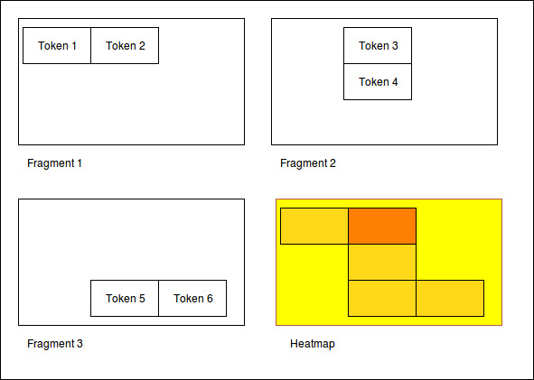
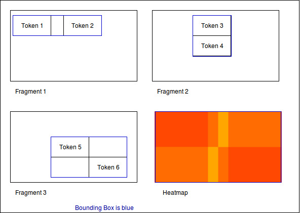
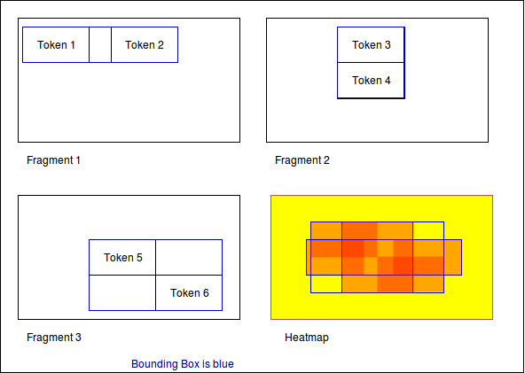
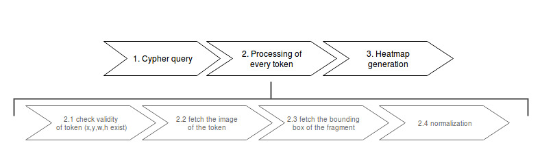
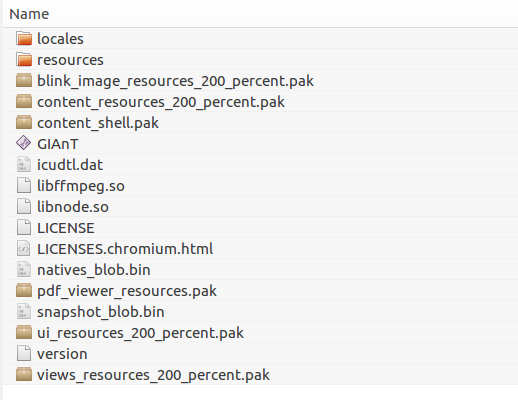
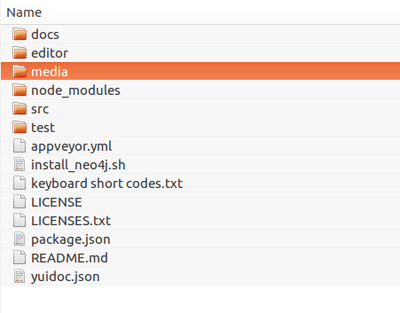

Guides
======

Feature overview
----------------

GIAnT is designed to work on **win32**, **osx** and **linux**.

It uses the **neo4j database** `<https://neo4j.com>`_ as graph storage which is **free to use** in the community edition.

Modelling your annotation use case happens in a graph environment:
**Think about your data as nodes and edges!**

GIAnT comes with an **Editor** which speeds up the annotation process of your images.

.. image:: sources/images/screenshots/feature_overview.png

It features:
 - different node types (with positional information and without)
 - layers which can be interpreted as chronology
 - properties of nodes with auto completion
 - copy'n'paste and standard image editor features
 - meta information (like EXIF data)

You store all of your images in the so called **Index**.

.. image:: sources/images/screenshots/index.png

Every image has **fragments**: They are based on the same image but store another subgraph.

.. image:: sources/images/screenshots/overview_fragments.png

You can add **comments** to fragments and mark them as **done**.

The **Heatmap Tool** can show you the distribution of the nodes on your annotated images.
You can use the **CYPHER** graph query language to select the input nodes for the heatmap algorithm.

.. image:: sources/images/screenshots/heatmap_overview.png

**Exporting** your data and images is possible.
The data can be exported to **CSV** and **SQL**.

.. image:: sources/images/screenshots/overview_export.png

The **editor's behaviour can be configured** to a certain extend.

.. image:: sources/images/screenshots/overview_settings.png

**Custom behaviour** can be implemented via **javascript**.

.. image:: sources/images/screenshots/overview_custom_js.png

**Data integrity** can be assured by using **data constraints**.

.. image:: sources/images/screenshots/overview_constraints.png

Installation
------------

GIAnT needs a database connection to neo4j. This can be local (on your machine) or over the internet.

 1. Install Neo4j: `<https://neo4j.com/docs/operations-manual/current/installation/>`_
 2. Download GIAnT for your operating system: `<https://github.com/DanielPollithy/GIAnT/releases>`_
 3. Unzip the downloaded archive and start the **GIAnT**

Login to neo4j
--------------

Once you have started the GIAnT you are asked to login to your neo4j database:

.. image:: sources/images/screenshots/login_screen.png

The first box asks for the end point: **bolt://localhost:7687**
 - *bolt://* stands for the protocol which is used for the connection
 - *localhost* stands for the local machine (you could replace this by an IP-address in order to connect to a server)
 - *:7687* is the database port on which the neo4j application is listening on

The second box asks for the username: *default is neo4j*

The third box asks for the password: *default is neo4j*
**The password is not explicitly stored in the application. Therefore you have to enter it on every login.**

Getting started
---------------

Now that you are logged in you are able to use the application.
This guide shows you how to use the application. Don't enter any serious data until you came up with
a scheme for your special purpose!

Uploading an image
..................

Clicking on the index button gets you to a table containing all of your uploaded images.

.. image:: sources/images/screenshots/index_bar.png

At the bottom of the page there is an upload button.

**Attention: You can only upload jpeg files**

.. image:: sources/images/screenshots/upload.png

Once uploaded a line appears in the table. Before that the creation date of the picture and the **GPS location**
are being extracted and stored in the database.

.. image:: sources/images/screenshots/indexline.png

- The **ID** is a unique identifier
- The **Pfad** contains the name of the uploaded image
- **Erstellungsdatum** is the EXIF creation date which was stored in the JPEG image
- **Fragmente** is a link to the fragments that belong to the image
- **Löschen** signifies *deletion*

You can click on the table headers in order to sort the table by specific columns.

Creating a fragment
...................

The same procedure can be repeated for the creation of a fragment.

.. image:: sources/images/screenshots/new_frag.png

A fragment has a name for human identification, you can add a comment, mark the fragment *ready*
open the **Editor** for the fragment and transfer the specific fragment to the neo4j database.

.. image:: sources/images/screenshots/frag_line.png

Transfer to neo4j
.................

In order to transfer your data created within the editor you can

 - use the 'Übertragen' link in the fragment's line
 - or click on the 'Batch add' button in the menu bar

.. image:: sources/images/screenshots/batch_add.png

**The batch add makes use of hash codes.**
That means: Only fragments that have been changed or are not in
the database right now are transferred to neo4j.

Using the editor
----------------

Overview
........

The editor is where your work happens. We implemented some features to improve your productivity.
But first comes the basics.

Layers
......

You start off only with the Background layer. It is not possible to attach any data to this layer (that is why you can't change the
status of the lock icon). The only function it has is the checkbox which switches the visibility of the layer on and off.

Imagine you already have a quite populated layers on top of the image. Sometimes it can be better (less distraction) to hide the
background image for a while.

.. image:: sources/images/screenshots/layers.PNG

To start editing you have to click on the '+'-Button in order to add a new layer. The name of the layer is no changable on purpose. 
The lock will be open on this layer because you are still editing it. If you want to make sure that no errors occur meanwhile you are
editing another layer, feel free to lock it.

The trash icon of course stands for the deletion of the layer. The only sideeffect that can happen here is that gaps in the enumeration
appear. Say we created 3 layers. Deleted the second one. Now only layer "1" and "3" remain. The chronology of course is still there.

If you closed the layers panel by clicking the "x" button in the upper right corner, 
you can get the panel by clicking "View" -> "Outline".

Nodes
.....

We call every box which is drawn on a layer a node. The different types of boxes can be configured through the settings.
In general every different entity should have its own node type (box type).

.. image:: sources/images/screenshots/node_types.PNG

By double clicking on one box you can edit the content of it. This might not be necessary for your use-case but is auxiliary if
you want to make your annotations easy readable.

The given box types are divided into to categories:
 - Singular Tokens (positional)
 - Group Tokens

The default setup interprets them as follows: 

The singular tokens contain text or at least a symbole.
  - "Token" is a real textual component (maybe a word)
  - "Modification" is always overlapping a "Token" (maybe a strike-through or an overwriting)
  - "Symbol" is straight-forward a symbole
  
The Group Tokens shall not carry positional information. They are called "Groups".
  - "Comment" is a group of singular tokens that relates over one single entity to another group (Imagine to grafitis on neighbouring walls relating to each others)
  - "Frame" shall carry the psychological framing. The "Frame" Group is special because it connects to MetaGroups. (see next paragraph)
  - "Blanco" is a general purpose group
  
Fictional example for comment groups:

.. image:: sources/images/screenshots/comments.PNG

Properties can be attached to tokens. See section "properties".

Relations
.........

The entities of your image annotations are expressed by tokens.
GIAnT becomes handy when these tokens interact with each others or the important information lays in "between" them.
(This is also the case where graph databases can serve with their graph query languages.)

.. image:: sources/images/screenshots/book.PNG

Different kinds of exemplary relations can be examined:
 - "part of" relations: a word is part of a sentence etc.
 - "follows" relation: a word follows another word
 - "negates" relation: an expression negates the related expression
 - "opens frame" relation: a word or symbole opens a psychological frame
 - ... (lots of possibilites)

Properties can be attached to relations. See section "properties".

Properties
..........

Properties are attaches to relations and tokens. The stored information is transferred directly into the graph database so it can be used for querying your data.

.. image:: sources/images/screenshots/properties.PNG

**Cool Features:**
Every property you have transferred into the neo4j graph database is used to enhance your experience by providing autocompletion:
There is autocomletion on:

- property names and
- property values
 
Selecting a new property from the autocompletion.

.. image:: sources/images/screenshots/property_name.PNG

Selecting a value for the given property from the autocompletion.

.. image:: sources/images/screenshots/property_value.PNG
 
The autocompletion is token type, property and relation type sensitive.

Different tokens need distinct properties. You can configure this with the settings and even give default values and javascript validations. There are a lot of possibilities to model your use-case with this tools.

Data scheme in neo4j
--------------------

The GIAnT can be seen as a Graphical Image Annotation Tool that stores your data in Neo4j. So you get all of the advantages graph databases have.

Access to your neo4j database is usually at this local url: http://127.0.0.1:7474

The boxes and edges you drawn in the editor are reflected by the following scheme in Neo4j.

Images
......

Every uploaded image is represented by a node. Neo4J label: :code:`:Image`

The following Cypher query retrieves it for you:

.. image:: sources/images/screenshots/1_image.PNG

.. image:: sources/images/screenshots/image.PNG

Image properties

+--------------------------+-------------------------+
| Property                 | Name                    |
+==========================+=========================+
| A unique ID              | :code:`id`              |
+--------------------------+-------------------------+
| File path                | :code:`file_path`       |
+--------------------------+-------------------------+
| The width in pixels      | :code:`width`           |
+--------------------------+-------------------------+
| The height in pixels     | :code:`height`          |
+--------------------------+-------------------------+
| EXIF date or upload date | :code:`upload_date`     |
+--------------------------+-------------------------+

.. image:: sources/images/screenshots/image_data.PNG

By expanding the child relations (lower circle segment button)...

.. image:: sources/images/screenshots/image.PNG

Fragments
.........

You see that images are connected to fragments. Neo4J label: :code:`:Fragment`
Fragments are interpretations or multiple areas of one image. 
Explicit: One image relates to many fragments but one fragment only relates to one image. We call this 1-n relationship.

The Neo4J Label of the relation between Image and Fragment is called :code:`:image`.

.. image:: sources/images/screenshots/image_fragment.PNG

By expanding the Fragment's relations we see that the boxes we drew in the Editor are nodes on this hierarchy level.

.. image:: sources/images/screenshots/image_fragment_nodes.PNG

The Neo4J Label of the relation between Fragment and Token is called :code:`:fragment`. Every fragment is connected to many tokens (1-n relationship).

Properties of Fragments

+--------------------------+-------------------------+
| Property                 | Name                    |
+==========================+=========================+
| A unique ID              | :code:`id`              |
+--------------------------+-------------------------+
| Fragment name            | :code:`fragment_name`   |
+--------------------------+-------------------------+
| Use with batch-add?      | :code:`completed`       |
+--------------------------+-------------------------+
| Helps to detect changes  | :code:`checksum`        |
+--------------------------+-------------------------+
| Creation date            | :code:`upload_date`     |
+--------------------------+-------------------------+

.. image:: sources/images/screenshots/fragment_data.PNG

Tokens
......

Tokens are what we also called boxes in the context of the Editor. 
There are two groups:

- Singular Tokens: they carry positional information
- Group tokens: they group together and stand as an entity for multiple tokens that need to have relations between other groups
 
The Neo4j label for singular Tokens is :code:`:Token`.

The Neo4j label for Group Tokens is :code:`:Group`.

The following image illustrates how the Groups and Singular Tokens can be seen as distinct hierarchy layers.

.. image:: sources/images/screenshots/hierarchy_4.PNG

1. Image
2. Fragment
3. Singular Token (Symbole, Modification, Text)
4. Group Token (Comment, Frame, Blanco)

Singular Tokens
...............

Interesting Properties of **Singular Tokens**

+--------------------------+-------------------------+
| Property                 | Name                    |
+==========================+=========================+
| A unique ID              | :code:`id`              |
+--------------------------+-------------------------+
| width [pixels]           | :code:`width`           |
+--------------------------+-------------------------+
| height [pixels]          | :code:`height`          |
+--------------------------+-------------------------+
| position [pixels]        | :code:`x, y`            |
+--------------------------+-------------------------+
| The type of the Token*   | :code:`:tokenType`      |
+--------------------------+-------------------------+
| The box's content**      | :code:`value`           |
+--------------------------+-------------------------+
| The number of the layer  | :code:`hand`            |
+--------------------------+-------------------------+
| All custom properties    | e.g. color, tool, ...   |
+--------------------------+-------------------------+

(*) Possible default tokenTypes are: token, symbol, modification

(**) The content of the box is what you enter when you double click into the box

.. image:: sources/images/screenshots/token_props.PNG

Groups
......

Interesting Properties of **Group Tokens**

+--------------------------+-------------------------+
| Property                 | Name                    |
+==========================+=========================+
| A unique ID              | :code:`id`              |
+--------------------------+-------------------------+
| The type of the Group*   | :code:`:groupType`      |
+--------------------------+-------------------------+
| The box's content**      | :code:`value`           |
+--------------------------+-------------------------+
| The number of the layer  | :code:`hand`            |
+--------------------------+-------------------------+
| All custom properties    | e.g. frame_type...      |
+--------------------------+-------------------------+

(*) Possible default groupTypes are: comment, frame, blanco

(**) The content of the box is what you enter when you double click into the box

.. image:: sources/images/screenshots/group_props.PNG

**Attention:** The Group Token "Frame" introduces another Graph Database Node called **MetaFrame**. The Neo4j label for this is :code:`:MetaGroup`.
This node is an interconnection of all "Frames" with the same name in order to ease graph exploration.

Example: The Token with text "Kill" in one fragment is connected to a Frame called "Violence". In another image's fragment there is also
a Token connected to Frame called "Violence". Both Token Groups "Frame" are connected to the MetaGroup "Violence" which is created automatically.

.. image:: sources/images/screenshots/hierarchy_5.PNG

Interesting Properties of **MetaGroups**

+--------------------------+-------------------------+
| Property                 | Name                    |
+==========================+=========================+
| A unique ID              | :code:`id`              |
+--------------------------+-------------------------+
| The type of the Group*   | :code:`:groupType`      |
+--------------------------+-------------------------+
| value                    | :code:`value`           |
+--------------------------+-------------------------+

(*) Only MetaFrame is possible so far!

Edges
.....

The tokens are interconneted with multiple edges. This is not a 1-n relationship but a many-to-many relationship (called m-n).
The Neo4J Label of the relation between Token and Token is called :code:`:edge`. 

Do not confuse this with the relations between Images and Fragments nor Fragments and Tokens!

.. image:: sources/images/screenshots/edge.PNG

Interesting Properties of **Edges**

+--------------------------+-------------------------+
| Property                 | Name                    |
+==========================+=========================+
| A unique ID              | :code:`id`              |
+--------------------------+-------------------------+
| Type of relation         | :code:`:relation_type`  |
+--------------------------+-------------------------+
| All custom properties    | e.g. frame_type...      |
+--------------------------+-------------------------+

.. image:: sources/images/screenshots/edge_props.PNG

Using Cypher
............

Now that you know how your data is structured in the graph database you might already have ideas on what kind of information you want to retrieve from your 'corpus'.

**Using the GIAnT but refusing to use Cypher is a waste of time!**
Cypher is the SQL oriented query language for neo4j graph databases. https://neo4j.com/developer/cypher-query-language/

It can really help you to find quickly what you are looking for but you have to get into it a little bit and design your corpus accordingly.

Heatmap tool
------------

The heatmap tool can be used to analyze the positions of tokens.
It might be interesting to see the density of tokens in a region or the outline they form.
The input for this tool has to be a Cypher query. It will then only work with the tokens,
therefore it is recommended to build your query to only return tokens.

Example query:
:code:`MATCH (s:Token) RETURN s;`

The query is not analyzed or guarded. This means that any code can be executed.
As a consequence must this feature kept on a local system and not exposed through a webserver!

The color scheme of the heatmap reaches from 0 (yellow) to 1 (red).

Normalization techniques
........................

In this context the term normalization refers to an algorithm that makes the positions
of tokens in different images comparable.

There are three types of normalizations present:

Normalization 1: Position in image
..................................

All images are normalized to the output size.
The tokens are scaled accordingly.

The final result is the distribution of tokens over the images.

Normalization 2: Position in scritte (bounding box)
...................................................

This method fetches the Bounding Box(see below) of every image and scales
the tokens according to it.

The bounding box is the rectangle spanned by the lowest coordinate
to the highest one.

The result shows the distribution of tokens within the bounding box.

Normalization 3: Bounding box centered
......................................

Here the bounding box is placed into the normalised image.
But the position is changed: The box's center is placed over the normalisation target center.

As a result, the bounding boxes and by that way the outlines of all scritte are comparable.

This method could be used to extract the outline of fragments.
Example: Do they have a horizontal orientation or are they grouped like a
triangle.

Performance
...........

The heatmap creation process happens as a stream.

Processing every single token means some computation effort. Especially fetching images/bounding boxes
from the database costs resources, in particulary time.
The heatmap tool was never designed to be a big data application but rather a medium data application
that shall work with up to 3000 images containing 1 fragment containing 100 elements.

Based on this requirement a ram cache was introduced which is not persistent between heatmap generations
but could be implemented easily.
The cache prevents unnecessary database request.

The performance evaluation has shown that it is possible to generate heatmaps in reasonable time.

.. image:: sources/images/heatmap/performance.png

The most computation intense normalization took 15 minutes with 300.000 elements.
The data points of this chart are:

+----------------+----------------------+--------------+--------------+
| Total elements | Normalization #1 [s] | Norm. #2 [s] | Norm. #3 [s] |
+================+======================+==============+==============+
| 1.000          | 1                    | 1            | 1            |
+----------------+----------------------+--------------+--------------+
| 2.000          | 1                    | 1            | 2            |
+----------------+----------------------+--------------+--------------+
| 5.000          | 4                    | 9            | 7            |
+----------------+----------------------+--------------+--------------+
| 10.000         | 9                    | 30           | 14           |
+----------------+----------------------+--------------+--------------+
| 50.000         | 45                   | 156          | 83           |
+----------------+----------------------+--------------+--------------+
| 100.000        | 100                  | 205          | 163          |
+----------------+----------------------+--------------+--------------+
| 300.000        | 550                  | 989          | 701          |
+----------------+----------------------+--------------+--------------+

The performance test took place on regular Ubuntu 16.04 with 64 bit on a laptop with
Intel® Core™ i5-2520M CPU @ 2.50GHz × 4,
and 3,7 GiB RAM and
a HDD.

Data constraints
----------------

In database context 'check constraints' are a mean to assure data integrity.

This application could have varying use cases. From case to case the constraints for the graph
scheme differ.

One use case might restrict the number of edges between nodes. Another one the total amount of nodes
and so on.

As a result this application does not contain a set of 'hard coded' constraints but a configuration
file that contains Cypher queries which will be executed every time a graph was inserted into
Neo4j.

The workflow
............

GraphEditor -> codec.js -> Neo4j -> constraints.js

Opposite to usual RDMS Neo4j only comes with a limited set of data integrity constraints.
Usually these constraints are checked before inserting data into the database.

This workflow does not do so because we want the user to be able to write Cypher query code.
In a future version it could be possible that a failing constraint triggers the transaction
to be rolled back. So far this doesn't happen.

Design of the constraints
.........................

In the end the constraints have to validate so their output is boolean.

If all constraints are true -> then the constraint checking succeeded and there is no error

Else: We hand the error to the user.

Writing constraints
...................

There is an entry in the menu which is called 'Constraints'.
In that view you can create three types of constraints:

- bool constraints: Your query has to return 'true' to succeed
- count constraints: You write a query and provide a minimum and/or maximum of accepted results to your query
- free constraints: you write javascript code (in detail a Promise: see below for an example)

Example for count constraint
............................

You provide a query like :code:`MATCH (a:Token)-[]-(i:Image) RETURN DISTINCT a;`
and the boundaries (lower is contained, upper exluded): [0, 200[

Example for a free constraint
.............................

You can supply any javascript code returning a promise. If it resolves your constraint succeeds.

**Variables handed into the scope**

:code:`session` is a neo4j session

:code:`session.run(cypher_string)` returns a Promise. This will be the entry point for most of the free constraints.

The following example checks whether tokens with the value 'Token' exist.

.. code-block:: javascript
    :linenos:

    new Promise(
        function(resolve, reject){
            var variables = {"fragment_id": fragment_id};
            session.run("MATCH(f:Fragment)-[]-(t:Token {value: 'Token'}) " +
                        "WHERE ID(f) = {fragment_id} RETURN t.value as value;", variables)
                .then(function(result){
                    var value;
                    result.records.forEach(function(res){
                        value = res.get('value');
                        if (value === "Token2") {
                            reject("There was a token called Token.");
                        }
                    });
                    resolve();
                }).catch(
                    function(err){
                        reject(err);
                });
            });

Security
........

The cypher queries are checked to not contain :code:`CREATE`, :code:`MERGE`, :code:`SET` or any other operation
that could change the data while performing the check. If that happens only a message is prompted
to the user.

These operations could be in the query willingly so they will still get executed in order to
enhance the power of the user on the data.

Exporting your data
-------------------

It is very likely that you don't only want to analyze your data but also take it with you to another application.

There are three possibilities to export your data:
 * SQL export
 * CSV export
 * Copy the Neo4J database (see section Migration)

The SQL and CSV export are structured in order to give the ability to reassemble the graph.

Both of them are structured into four tables:
 - Nodes table
 - Properties of nodes table
 - Relations table
 - Properties of relations table

With the following schema (see section data schema for reference):

**Nodes table**

+----------------+----------------------+---------------+---------------+
| Node_ID        | value                | tokenType     | groupType     |
+================+======================+===============+===============+
| 1              | NULL                 | NULL          | NULL          |
+----------------+----------------------+---------------+---------------+
| 2              | NULL                 | NULL          | NULL          |
+----------------+----------------------+---------------+---------------+

**Node properties table**

+----------------+----------------------+--------------+
| Node_ID        | key                  | value        |
+================+======================+==============+
| 1              | file_path            | 1234.jpg     |
+----------------+----------------------+--------------+
| 2              | comment              | fragment#1   |
+----------------+----------------------+--------------+

**Relations table**

+----------------+----------------------+---------------+---------------+
| Relation_ID    | relationType         | SourceNode_ID | TargetNode_ID |
+================+======================+===============+===============+
| 1              | image                | 1             | 2             |
+----------------+----------------------+---------------+---------------+

**Relation properties table**

+----------------+----------------------+--------------+
| Relation_ID    | key                  | value        |
+================+======================+==============+
| 1              | label                | image        |
+----------------+----------------------+--------------+

Transferring your data
----------------------

If you want to take your data to another computer follow these steps.

1. Move static files
....................

The folder containing the application contains a folder called 'media'.
Compress this folder (e.g. zip it), transport the archive to the new computer
and uncompress it into the new 'media' folder.

This folder contains settings files, the graph editor's xmls and the images.

2. Relocate the Neo4j database
..............................

We have to move the Neo4j database to the new computer. There are two options:

- 2/a: has not worked in the tests but is recommended by Neo4j -> dump'n'load (UNIX)
- 2/b: has worked but is a little dangerous -> copy'n'paste (WINDOWS)

2/a Dump and load Neo4j (UNIX)
..............................

According to https://neo4j.com/docs/operations-manual/current/tools/dump-load/

- :code:`stop neo4j`
- :code:`neo4j-admin dump --database=<database> --to=<destination-path>`
- :code:`neo4j-admin load --from=<archive-path> --database=<database> [--force]`
- :code:`start neo4j`

Example for unix:

On machine 1

- :code:`sudo service neo4j stop`
- :code:`neo4j-admin dump --to=dump.db`
- :code:`sudo service neo4j start`

On machine 2

- :code:`sudo service neo4j stop`
- :code:`neo4j-admin load --from=dump.db --force`
- :code:`sudo service neo4j start`

Use the 'force' option to overwrite existing data

2/b Second variant for neo4j (WIN)
..................................

If this doesn't work it is possible to copy the whole database directory to the new computer.
By default the database is called graph.db and is situated under /var/lib/neo4j/data/database/graph.db/.
Move the whole folder to your new computer and :code:`service neo4j start`

Example workflow for UNIX:

 - :code:`sudo service neo4j stop`
 - :code:`zip -r ~/Desktop/dump.zip /var/lib/neo4j/data/databases/graph.db/`
 - :code:`sudo unzip dump.zip -d /`
 - :code:`service neo4j start`

Installing an update
--------------------

If a new version of GIAnT is released you might want to use it depending on the fixes or new tools.

Compatibility
.............

It is easy for you to decide whether there will be a conflict installing the new version or not.

GIAnT uses semantic versioning. This means that the applications version number "x.y.z"
is not only a counter for the changes made to the code but also
an indicator for what has changed.

:code:`<major>.<minor>.<patch>` is the system you might know.

- If :code:`patch` changes then there was a small security fix or a bug closed. You can install the new
    version without breaking anything.
- If :code:`minor` was increased then there were big changes made but they are still **backwards compatible**.
    You can install the new version without breaking your database but for example a tool of the software might
    have been removed.
- If :code:`major` was increased then the new version contains **NOT backwards compatible** changes.
    You will have to migrate your data to a new schema.

If you really want to find out what changed you have to look into the *CHANGELIST*.

How to
......

Updating is easy.
Check your compatibility with the new version.
And then download the new version and copy your data(next section).

Keeping your data
.................

There are two data stores for GIAnT.

- The Neo4J database
- Your filesystem

If you updated GIAnT you don't have to touch the database.

What you have to do is copy your files to the new application.

When you navigate to the folder where GIAnT is located in you will see a directory structure like this:

Please navigate to 'resources' -> 'app'

The 'media' folder contains all of your stored files and settings.

**You have to replace the new 'media' folder by the old 'media' in order to keep your data.**

Accessing your data on multiple devices
---------------------------------------

It is possible to synchronize the application's data on multiple devices so you can use GIAnT
on - let's say - your laptop and your PC.

Use one of the many sync-services out there like Google Drive or Dropbox to sync:

- Your Neo4J database folder
- Your installation's '/media/' folder which is located under  'GIAnT/resources/app/media'

**But please** don't use them in parallel. Better safe then sorry. I also recommend to switch off the
syncing while working on your data.

