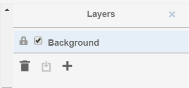

Guides
======

Feature overview
----------------

TraApp is designed to work on **win32**, **osx** and **linux**.

It uses the **neo4j database** `<https://neo4j.com>`_ as graph storage which is **free to use** in the community edition.

Modelling your annotation use case happens in a graph environment:
**Think about your data as nodes and edges!**

TraApp comes with an **Editor** which speeds up the annotation process of your images.

.. image:: sources/images/screenshots/feature_overview.png

It features:
 - different node types (with positional information and without)
 - layers which can be interpreted as chronology
 - properties of nodes with auto completion
 - copy'n'paste and standard image editor features

You store all of your images in the so called **Index**.

.. image:: sources/images/screenshots/index.png

Every image has **fragments**: They are based on the same image but store another subgraph.

.. image:: sources/images/screenshots/overview_fragments.png

You can add **comments** to fragments and mark them as **done**.

The **Heatmap Tool** can show you the distribution of the nodes on your annotated images.
You can use the **CYPHER** graph query language to select the input nodes for the heatmap algorithm.

.. image:: sources/images/screenshots/heatmap_overview.png

**Exporting** your data and images is possible.
The data can be exported to **CSV** and **SQL**.

.. image:: sources/images/screenshots/overview_export.png

The **editor's behaviour can be configured** to a certain extend.

.. image:: sources/images/screenshots/overview_settings.png

**Custom behaviour** can be implemented via **javascript**.

**Data integrity** can be assured by using **data constraints**.

Installation
------------

TraApp needs a database connection to neo4j. This can be local (on your machine) or over the internet.

 1. Install Neo4j: `<https://neo4j.com/docs/operations-manual/current/installation/>`_
 2. Download TraApp for your operating system: `<https://github.com/DanielPollithy/TransliterationApplication/releases>`_
 3. Unzip the downloaded archive and start the **TransliterationApplication**

Login to neo4j
--------------

Once you have started the TraApp you are asked to login to your neo4j database:

.. image:: sources/images/screenshots/login_screen.png

The first box asks for the end point: **bolt://localhost:7687**
 - *bolt://* stands for the protocol which is used for the connection
 - *localhost* stands for the local machine (you could replace this by an IP-address in order to connect to a server)
 - *:7687* is the database port on which the neo4j application is listening on

The second box asks for the username: *default is neo4j*

The third box asks for the password: *default is neo4j*
**The password is not explicitly stored in the application. Therefore you have to enter it on every login.**

Getting started
---------------

Now that you are logged in you are able to use the application.
This guide shows you how to use the application. Don't enter any serious data until you came up with
a scheme for your special purpose!

Uploading an image
..................

Clicking on the index button gets you to a table containing all of your uploaded images.

.. image:: sources/images/screenshots/index_bar.png

At the bottom of the page there is an upload button.

**Attention: You can only upload jpeg files**

.. image:: sources/images/screenshots/upload.png

Once uploaded a line appears in the table:

.. image:: sources/images/screenshots/indexline.png

 - The **ID** is a unique identifier
 - The **Pfad** contains the name of the uploaded image
 - **Erstellungsdatum** is the EXIF creation date which was stored in the JPEG image
 - **Fragmente** is a link to the fragments that belong to the image
 - **Löschen** signifies *deletion*

You can click on the table headers in order to sort the table by specific columns.

Creating a fragment
...................

The same procedure can be repeated for the creation of a fragment.

.. image:: sources/images/screenshots/new_frag.png

A fragment has a name for human identification, you can add a comment, mark the fragment *ready*
open the **Editor** for the fragment and transfer the specific fragment to the neo4j database.

.. image:: sources/images/screenshots/frag_line.png

Transfer to neo4j
.................

In order to transfer your data created within the editor you can

 - use the 'Übertragen' link in the fragment's line
 - or click on the 'Batch add' button in the menu bar

.. image:: sources/images/screenshots/batch_add.png

**The batch add makes use of hash codes.**
That means: Only fragments that have been changed or are not in
the database right now are transferred to neo4j.

Using the editor
----------------

Overview
........

The editor is where your work happens. We implemented some features to improve your productivity.
But first comes the basics.

Layers
......

You start off only with the Background layer. It is not possible to attach any data to this layer (that is why you can't change the
status of the lock icon). The only function it has is the checkbox which switches the visibility of the layer on and off.

Imagine you already have a quite populated layers on top of the image. Sometimes it can be better (less distraction) to hide the
background image for a while.

To start editing you have to click on the '+'-Button in order to add a new layer. The name of the layer is no changable on purpose. 
The lock will be open on this layer because you are still editing it. If you want to make sure that no errors occur meanwhile you are
editing another layer, feel free to lock it.

The trash icon of course stands for the deletion of the layer. The only sideeffect that can happen here is that gaps in the enumeration
appear. Say we created 3 layers. Deleted the second one. Now only layer "1" and "3" remain. The chronology of course is still there.

If you closed the layers panel by clicking the "x" button in the upper right corner, 
you can get the panel by clicking "View" -> "Outline".

Nodes
.....

We call every box which is drawn on a layer a node. The different types of boxes can be configured through the settings.
In general every different entity should have its own node type (box type).

By double clicking on one box you can edit the content of it. This might not be necessary for your use-case but is auxiliary if
you want to make your annotations easy readable.

The given box types are divided into to categories:
 - Singular Tokens (positional)
 - Group Tokens

The default setup interprets them as follows: 

The singular tokens contain text or at least a symbole.
  - "Token" is a real textual component (maybe a word)
  - "Modification" is always overlapping a "Token" (maybe a strike-through or an overwriting)
  - "Symbol" is straight-forward a symbole
  
The Group Tokens shall not carry positional information. They are called "Groups".
  - "Comment" is a group of singular tokens that relates over one single entity to another group (Imagine to grafitis on neighbouring walls relating to each others)
  - "Frame" shall carry the psychological framing. The "Frame" Group is special because it connects to MetaGroups. (see next paragraph)
  - "Blanco" is a general purpose group
  
Fictional example for comment groups:

.. image:: sources/images/screenshots/comments.PNG

Properties can be attached to tokens. See section "properties".

Relations
.........

The entities of your image annotations are expressed by tokens.
TransliterationApplication becomes handy when these tokens interact with each others or the important information lays in "between" them.
(This is also the case where graph databases can serve with their graph query languages.)

.. image:: sources/images/screenshots/book.PNG

Different kinds of exemplary relations can be examined:
 - "part of" relations: a word is part of a sentence etc.
 - "follows" relation: a word follows another word
 - "negates" relation: an expression negates the related expression
 - "opens frame" relation: a word or symbole opens a psychological frame
 - ... (lots of possibilites)

Properties can be attached to relations. See section "properties".

Properties
..........

Properties are attaches to relations and tokens. The stored information is transferred directly into the graph database so it can be used for querying your data.

**Cool Features:**
Every property you have transferred into the neo4j graph database is used to enhance your experience by providing autocompletion:
There is autocomletion on:
 - property names and
 - property values
 
Selecting a new property from the autocompletion.

Selecting a value for the given property from the autocompletion.

 
The autocompletion is token type, property and relation type sensitive.

Different tokens need distinct properties. You can configure this with the settings and even give default values and javascript validations. There are a lot of possibilities to model your use-case with this tools.

Data scheme in neo4j
--------------------

The TransliterationApplication can be seen as a Graphical Image Annotation Tool that stores your data in Neo4j. So you get all of the advantages graph databases have. 

Access to your neo4j database is usually at this local url: http://127.0.0.1:7474

The boxes and edges you drawn in the editor are reflected by the following scheme in Neo4j.

Images
......

Every uploaded image is represented by a node. Neo4J label: :code:`:Image`

The following Cypher query retrieves it for you:

.. image:: sources/images/screenshots/1_image.PNG

.. image:: sources/images/screenshots/image.PNG

Image properties

+--------------------------+-------------------------+
| Property                 | Name                    |
+==========================+=========================+
| A unique ID              | :code:`id`             |
+--------------------------+-------------------------+
| File path                | :code:`file_path`      |
+--------------------------+-------------------------+
| The width in pixels      | :code:`width`          |
+--------------------------+-------------------------+
| The height in pixels     | :code:`height`         |
+--------------------------+-------------------------+
| EXIF date or upload date | :code:`upload_date`    |
+--------------------------+-------------------------+

.. image:: sources/images/screenshots/image_data.PNG

By expanding the child relations (lower circle segment button)...

.. image:: sources/images/screenshots/image.PNG

Fragments
.........

You see that images are connected to fragments. Neo4J label: :code:`:Fragment`
Fragments are interpretations or multiple areas of one image. 
Explicit: One image relates to many fragments but one fragment only relates to one image. We call this 1-n relationship.

The Neo4J Label of the relation between Image and Fragment is called :code:`:image`.

.. image:: sources/images/screenshots/image_fragment.PNG

By expanding the Fragment's relations we see that the boxes we drew in the Editor are nodes on this hierarchy level.

.. image:: sources/images/screenshots/image_fragment_nodes.PNG

The Neo4J Label of the relation between Fragment and Token is called :code:`:fragment`. Every fragment is connected to many tokens (1-n relationship).

Properties of Fragments

+--------------------------+-------------------------+
| Property                 | Name                    |
+==========================+=========================+
| A unique ID              | :code:`id`             |
+--------------------------+-------------------------+
| Fragment name            | :code:`fragment_name`  |
+--------------------------+-------------------------+
| Use with batch-add?      | :code:`completed`      |
+--------------------------+-------------------------+
| Helps to detect changes  | :code:`checksum`       |
+--------------------------+-------------------------+
| Creation date            | :code:`upload_date`    |
+--------------------------+-------------------------+

.. image:: sources/images/screenshots/fragment_data.PNG

Tokens
......

Tokens are what we also called boxes in the context of the Editor. 
There are two groups:
 - Singular Tokens: they carry positional information
 - Group tokens: they group together and stand as an entity for multiple tokens that need to have relations between other groups
 
The Neo4j label for singular Tokens is :code:`:Token`.

The Neo4j label for Group Tokens is :code:`:Group`.

The following image illustrates how the Groups and Singular Tokens can be seen as distinct hierarchy layers.

.. image:: sources/images/screenshots/hierarchy_4.PNG

 1. Image
 2. Fragment
 3. Singular Token (Symbole, Modification, Text)
 4. Group Token (Comment, Frame, Blanco)

Singular Tokens
...............

Interesting Properties of **Singular Tokens**

+--------------------------+-------------------------+
| Property                 | Name                    |
+==========================+=========================+
| A unique ID              | :code:`id`              |
+--------------------------+-------------------------+
| width [pixels]           | :code:`width`           |
+--------------------------+-------------------------+
| height [pixels]          | :code:`height`          |
+--------------------------+-------------------------+
| position [pixels]        | :code:`x, y`            |
+--------------------------+-------------------------+
| The type of the Token*   | :code:`:tokenType`      |
+--------------------------+-------------------------+
| The box's content**      | :code:`:value`          |
+--------------------------+-------------------------+
| The number of the layer  | :code:`:hand`           |
+--------------------------+-------------------------+
| + All custom properties  | e.g. color, tool, ...   |
+--------------------------+-------------------------+

(*) Possible default tokenTypes are: token, symbol, modification

(**) The content of the box is what you enter when you double click into the box

.. image:: sources/images/screenshots/token_props.PNG

Groups
......

Interesting Properties of **Group Tokens**

+--------------------------+-------------------------+
| Property                 | Name                    |
+==========================+=========================+
| A unique ID              | :code:`id`              |
+--------------------------+-------------------------+
| The type of the Group*   | :code:`:groupType`      |
+--------------------------+-------------------------+
| The box's content**      | :code:`:value`          |
+--------------------------+-------------------------+
| The number of the layer  | :code:`:hand`           |
+--------------------------+-------------------------+
| + All custom properties  | e.g. frame_type...      |
+--------------------------+-------------------------+

(*) Possible default groupTypes are: comment, frame, blanco

(**) The content of the box is what you enter when you double click into the box

.. image:: sources/images/screenshots/group_props.PNG

**Attention:** The Group Token "Frame" introduces another Graph Database Node called **MetaFrame**. The Neo4j label for this is :code:`:MetaGroup`.
This node is an interconnection of all "Frames" with the same name in order to ease graph exploration.

Example: The Token with text "Kill" in one fragment is connected to a Frame called "Violence". In another image's fragment there is also
a Token connected to Frame called "Violence". Both Token Groups "Frame" are connected to the MetaGroup "Violence" which is created automatically.

.. image:: sources/images/screenshots/hierarchy_5.PNG

Interesting Properties of **MetaGroups**

+--------------------------+-------------------------+
| Property                 | Name                    |
+==========================+=========================+
| A unique ID              | :code:`id`              |
+--------------------------+-------------------------+
| The type of the Group*   | :code:`:groupType`      |
+--------------------------+-------------------------+
| value                    | :code:`:value`          |
+--------------------------+-------------------------+

(*) Only MetaFrame is possible so far!

Edges
.....

The tokens are interconneted with multiple edges. This is not a 1-n relationship but a many-to-many relationship (called m-n).
The Neo4J Label of the relation between Token and Token is called :code:`:edge`. 

Do not confuse this with the relations between Images and Fragments nor Fragments and Tokens!

.. image:: sources/images/screenshots/edge.PNG

Interesting Properties of **Edges**

+--------------------------+-------------------------+
| Property                 | Name                    |
+==========================+=========================+
| A unique ID              | :code:`id`              |
+--------------------------+-------------------------+
| Type of relation         | :code:`:relation_type`  |
+--------------------------+-------------------------+
| + All custom properties  | e.g. frame_type...      |
+--------------------------+-------------------------+

.. image:: sources/images/screenshots/edge_props.PNG

Using Cypher
............

Now that you know how your data is structured in the graph database you might already have ideas on what kind of information you want to retrieve from your 'corpus'.

**Using the TransliterationApplication but refusing to use Cypher is a waste of time!**
Cypher is the SQL oriented query langauge for neo4j graph databases. https://neo4j.com/developer/cypher-query-language/

It can really help you to find quickly what you are looking for but you have to get into it a little bit and design your corpus accordingly.  TODO: Add links to the following resources!

TODO: Diesen Absatz ausbauen!

Heatmap tool
------------

.. include:: ./sources/Heatmap.rst

Custom queries
--------------

What kind of queries could make sense? 

Data constraints
----------------

.. include:: ./sources/Constraints.rst

Exporting your data
-------------------

It is very likely that you don't only want to analyze your data but also take it with you to another application.

For this purpose TransliterationApplication comes with a **SQL and a CSV export**.

Both of them are structured into four tables:
 - Nodes table
 - Properties of nodes table
 - Relations table
 - Properties of relations table

