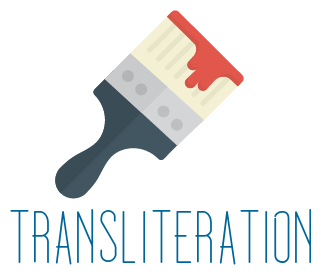

.. GIAnT documentation master file, created by
   sphinx-quickstart on Wed May 31 15:08:02 2017.
   You can adapt this file completely to your liking, but it should at least
   contain the root `toctree` directive.

GIAnT - Graphical Image Annotation Tool
=======================================

GIAnT is an open source cross platform desktop application designed
to aid scientists with graphical image annotation in the process of creating a corpus.

If you have a set of images, want to make annotations or even analyze how utters interact with each
other  this application might be useful for your project.

We built it for analyzing grafitis in Rome. Never the less the application is designed to be adapted for other studies.

Video
-----

.. raw:: html

    <iframe width="560" height="315" src="https://www.youtube.com/embed/4NRxlxq0TEY" frameborder="0" allowfullscreen></iframe>

GIAnT resources
---------------

+--------------------------+----------------------------------------------------------------------------+
| What                     | Where                                                                      |
+==========================+============================================================================+
| Download GIAnT           | `<https://github.com/DanielPollithy/GIAnT/releases>`_                      |
+--------------------------+----------------------------------------------------------------------------+
| Report a problem         | `<https://github.com/DanielPollithy/GIAnT/issues>`_                        |
+--------------------------+----------------------------------------------------------------------------+
| Get the code             | `<https://github.com/DanielPollithy/GIAnT>`_                               |
+--------------------------+----------------------------------------------------------------------------+
| Check the API            | `<https://github.com/DanielPollithy/GIAnT/>`_                              |
+--------------------------+----------------------------------------------------------------------------+
| Automatic win32 tests    | `<https://ci.appveyor.com/project/DanielPollithy/giant>`_                  |
+--------------------------+----------------------------------------------------------------------------+
| Automatic unix tests     | `<https://travis-ci.org/DanielPollithy/GIAnT>`_                            |
+--------------------------+----------------------------------------------------------------------------+
| Code coverage report     | `<https://coveralls.io/github/DanielPollithy/TransliterationApplication>`_ |
+--------------------------+----------------------------------------------------------------------------+
| Licenses                 | `<https://github.com/DanielPollithy/GIAnT/blob/master/LICENSES.txt>`_      |
+--------------------------+----------------------------------------------------------------------------+

This documentation is divided into three sections:

 1. **Guides:** An overview of the features for non-users and explanations to get you started
 2. **Articles** explaining the main features and advantages
 3. **Technical Documentations:** A Technical documentation which enables programmers to extend this application

Guides
------

.. toctree::
   :maxdepth: 4

   Guides

Articles
--------

.. toctree::
   :maxdepth: 4

   Articles

Technical Documentation
-----------------------

.. toctree::
   :maxdepth: 4

   Documentations

FAQs
----

.. toctree::
   :maxdepth: 2

   sources/FAQ

CHANGELOg
---------

.. toctree::
   :maxdepth: 2

   sources/CHANGELOG

Articles
========

The following article list will give you a good insight in all the knowledge about this application.

It is going to cover

 - "Basic data flow description"
 - "How mxGraph was modded",
 - "How Codex works - Codec.js - mxGraph XML -> GraphML -> Neo4J",
 - "Codec.js - What is the biggest XML-Graph it can convert to Neo4J?"
 - "The express.js server",
 - "Pug templates",
 - "Data storage XML and images",
 - "Exif data extraction",
 - "Electron application - and why",
 - "How to build the electron application cross platform",
 - "Could the server be used as a standalone?",
 - "How the autocomplete works",
 - "Writing custom constraints"
 - "How the settings work"
 - "Asynchronous tests with mocha.js and chai.js"
 - "Testu automation using travis and appveyor"
 - "About the code coverage"
 - "Extending the mxGraph Editor"
 - "What is not implemented"
 - "Next steps"

Maybe
 - "App performance struggle: Million of nodes, thousands of images and a lot of properties"

 - "A question of complexity: Cypher vs SQL for transliteration analyzes"
 - "The use case of this application"

Indices and tables
==================

* :ref:`genindex`
* :ref:`modindex`
* :ref:`search`

